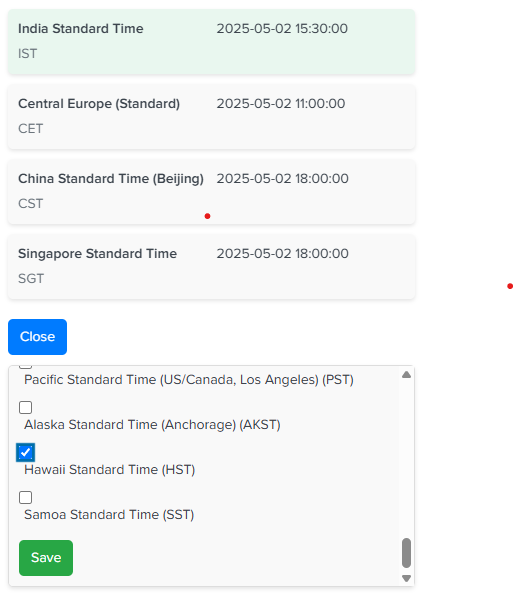

# xClock - Timezone Converter

## Overview

xClock is a Chrome extension designed to streamline the conversion of ISO datetime strings across multiple timezones. This browser-based solution eliminates the need to use external tools for timezone conversions, enhancing workflow efficiency. The extension caters primarily to software developers, data analysts, and professionals who routinely work with datetime data in different geographical regions. xClock was developed to address the challenges encountered during log analysis and debugging sessions, particularly when working with timestamp data from diverse systems and regions (especially Splunk).

Key features:
- Convert selected datetime text on any webpage
- Access conversion via context menu or keyboard shortcut
- Support for multiple timezones in a single view
- Simple and intuitive user interface

## Setup and Installation

To set up the extension in your local Chrome environment:

1. Clone or download this repository to your local machine
2. Open Chrome browser and navigate to `chrome://extensions/`
3. Enable "Developer mode" by toggling the switch in the top right corner
4. Click "Load unpacked" button
5. Select the folder containing the extension files (the folder with manifest.json)
6. The extension should now appear in your extensions list and the icon should be visible in the Chrome toolbar

## How to Use

### Method 1: Context Menu

1. Select an ISO datetime string on any webpage (e.g., "2023-06-15T10:30:00Z")
2. Right-click to open the context menu
3. Select "Convert Timezone" from the menu

### Method 2: Keyboard Shortcut

1. Select an ISO datetime string on any webpage
2. Press `Alt+Z` to instantly convert the selected time

### Adding/Removing Timezones

1. Open the extension popup by following any of the methods above
2. Add or remove timezones from the list by clicking the "Add/Remove" button

Note: The extension will remember your timezone preferences even after closing the popup. This is specific to the current site. If you navigate to a different site, the extension will remember the timezones you selected in that site or use the default timezone list.
